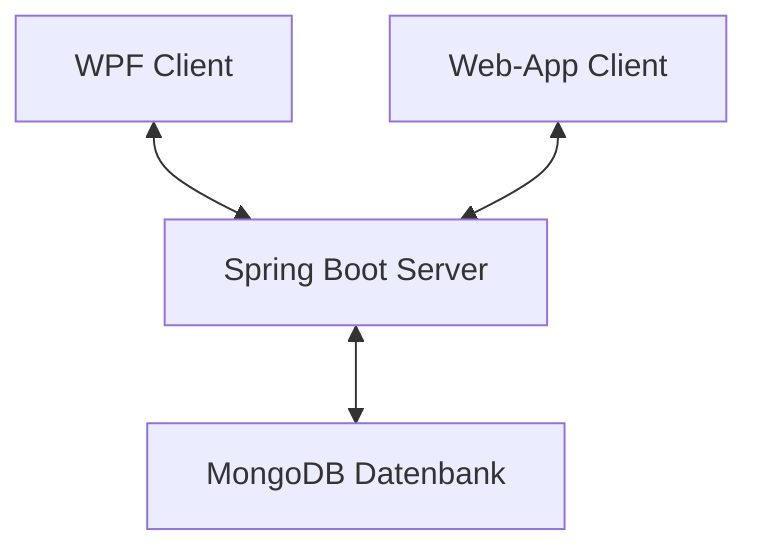

# Semesterprojekt: Fabian Scharfetter
 
## Softwaredesign (Architektur)
Die Geburtstags-Liste wurde in einer Client-Client-Server-Architektur entwicklet, wobei der Client als WPF-Anwendung oder WebApp implementiert ist und diese beide mit dem Server (welcher auf Spring Boot basiert) kommunizieren. Die Daten werden in einer MongoDB-Datenbank gespeichert.

## Softwarebeschreibung
Die Geburtstagslisten-Software ist eine plattformübergreifende Anwendung, die es Benutzern ermöglicht, Geburtstage zu verwalten und anzuzeigen. Es bietet eine benutzerfreundliche Oberfläche sowohl als Desktopanwendung (WPF) als auch als Webanwendung.  
Die Anwendung besteht aus drei Hauptkomponenten: 

Java-Server mit MongoDB-Datenbankanbindung
  
Der Java-Server fungiert als Backend der Anwendung. Er ist mit einer MongoDB-Datenbank verbunden, in der Geburtstagsdaten gespeichert werden. Der Server bietet folgende REST-API-Endpunkte zum Abrufen und Speichern von Geburtstagsinformationen. Server-Port ist 8081.  

Webseite mit dynamischem Kalender
  
Die Website dient als Frontend/Benutzeroberfläche der Anwendung. Sie besteht aus 3 Dateien (index.html, style.css, calender-script.js).  
Folgendermaßen ist die Seite aufgebaut:
1) Kalender, der per JavaScript dynamisch geladen wird
2) Ausgabe-Feld, bei dem die vom Server geladenen Geburtsdaten angezeigt werden.  
Die Geburtstage werden vom Server mit einem HTTP-Request (localhost:8081/geb-liste/geburtstage) geladen.    
Die Website bietet 2 Anzeigemodi --> Alle Geburtstage werden angezeigt ODER Die Geburtstage in dem Monat, der gerade am Kalender angezeigt wird
3) Eingabe-Feld, bei dem neue Geburtstage hinzugefügt werden können & mittels POST-Befehl an den Server geschickt werden

C#-Client
  
Der C#-Client ist eine eigenständige WPF-Anwendung, die es Benutzern ermöglicht, Geburtstage  zu verwalten. Der Client lädt Geburtstagsdaten asynchron vom Java-Server herunter und stellt sie in einem Ausgabefeld dar. Wenn die Verbindung zum Server nicht hergestellt werden kann, dann ist es möglich den Client offline zu nutzen. Benutzer können Geburtstage über die Benutzeroberfläche des Clients hinzufügen & löschen, wobei die Änderungen sofort mit dem Java-Server synchronisiert werden.  
Der Client ist ähnlich wie die Website aufgebaut:
1) Kalender, ist ein 'Calender' Element von WPF
2) Eingabefeld, bei dem neue Geburtstage hinzugefügt werden können & mittels POST-Befehl an den Server geschickt werden
3) Ausgabefeld, bei dem die vom Server geladenen Geburtsdaten angezeigt werden.  
Die Geburtstage werden vom Server asynchron geladen.  
Die Website bietet 2 Anzeigemodi --> Alle Geburtstage werden angezeigt ODER Die Geburtstage in dem Monat, der gerade am Kalender angezeigt wird  
ZUSÄTZLICH können Geburtsdaten bei einem Doppelklick gelöscht werden.

## API-Beschreibung

### GeburtstagController

  
/geburtstag

Dieser Endpunkt ist der generelle Endpoint der API, welcher vor dem jeweiligen spezifischen Endpoint geschrieben werden muss.

  
/geburtstage

Dieser Endpunkt ist der generelle Endpoint der API, welcher vor dem jeweiligen spezifischen Endpoint geschrieben werden muss.

  
/geburtstag/{id}

Dieser Endpunkt ist der generelle Endpoint der API, welcher vor dem jeweiligen spezifischen Endpoint geschrieben werden muss.

### WebController

  
/website

Dieser Endpunkt ist der generelle Endpoint der API, welcher vor dem jeweiligen spezifischen Endpoint geschrieben werden muss.

  
/newGeburtstag

Dieser Endpunkt ist der generelle Endpoint der API, welcher vor dem jeweiligen spezifischen Endpoint geschrieben werden muss.

## Verwendung der API (ev. mit Code-Ausschnitten)

## Ev. Diagramme (Use-Cases, Übersichtsdiagramme)

## Diskussion der Ergebnisse (Zusammenfassung, Hintergründe, Ausblick, etc.)

## Quellenverzeichnis / Links
- [YouTube Tutorial für Kalender mit HTML CSS & JavaScript](https://www.youtube.com/watch?v=Z1BGAivZRlE)

## Und wichtig: Die Grafiken müssen mittels Mermaid erstellt werden! 
(GitHub bietet eine Unterstützung für Mermaid Diagramme)
