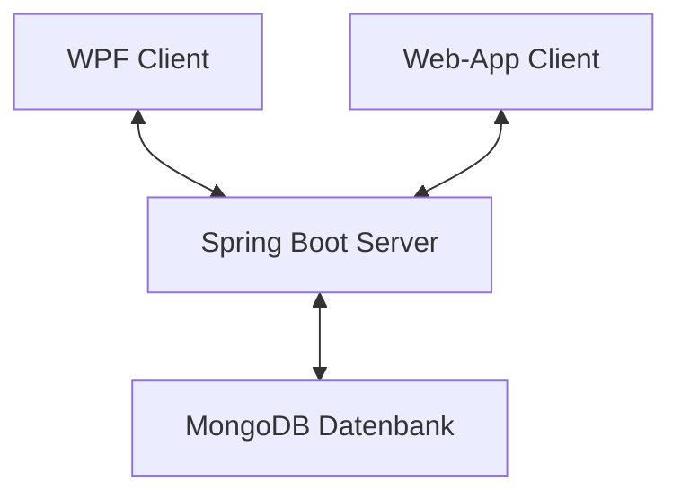
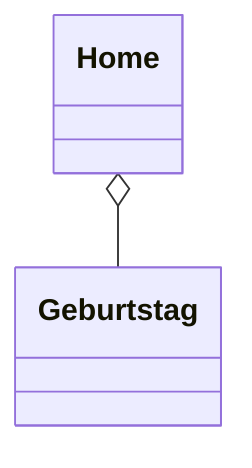
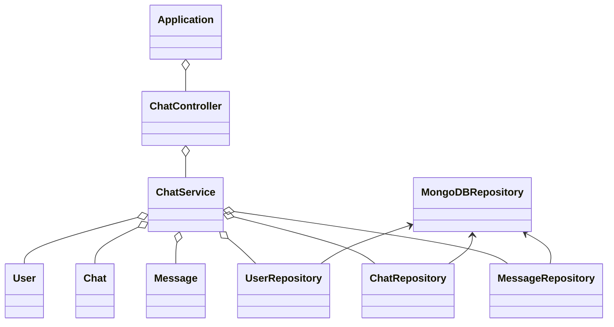
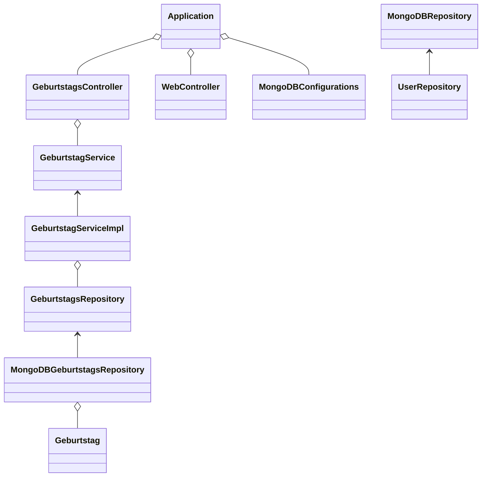

# Semesterprojekt: Fabian Scharfetter
 
## Softwaredesign (Architektur)
Die Geburtstags-Liste wurde in einer Client-Client-Server-Architektur entwicklet, wobei der Client als WPF-Anwendung oder WebApp implementiert ist und diese beide mit dem Server (welcher auf Spring Boot basiert) kommunizieren. Die Daten werden in einer MongoDB-Datenbank gespeichert.



## Softwarebeschreibung
Die Geburtstagslisten-Software ist eine plattformübergreifende Anwendung, die es Benutzern ermöglicht, Geburtstage zu verwalten und anzuzeigen. Es bietet eine benutzerfreundliche Oberfläche sowohl als Desktopanwendung (WPF) als auch als Webanwendung.  
Die Anwendung besteht aus drei Hauptkomponenten: 

<details>
<summary>Java-Server mit MongoDB-Datenbankanbindung</summary>  
   
Der Java-Server fungiert als Backend der Anwendung. Er ist mit einer MongoDB-Datenbank verbunden, in der Geburtstagsdaten gespeichert werden. Der Server bietet folgende REST-API-Endpunkte zum Abrufen und Speichern von Geburtstagsinformationen. Server-Port ist 8081.  
</details>

<details>
<summary>Webseite mit dynamischem Kalender</summary> 
   
Die Website dient als Frontend/Benutzeroberfläche der Anwendung. Sie besteht aus 3 Dateien (index.html, style.css, calender-script.js).  
Folgendermaßen ist die Seite aufgebaut:  
  
1) Kalender, der per JavaScript dynamisch geladen wird  
2) Ausgabe-Feld, bei dem die vom Server geladenen Geburtsdaten angezeigt werden.    
Die Geburtstage werden vom Server mit einem HTTP-Request (localhost:8081/geb-liste/geburtstage) geladen.      
Die Website bietet 2 Anzeigemodi --> Alle Geburtstage werden angezeigt ODER Die Geburtstage in dem Monat, der gerade am Kalender angezeigt wird
3) Eingabe-Feld, bei dem neue Geburtstage hinzugefügt werden können & mittels POST-Befehl an den Server geschickt werden
</details>

<details>
<summary>C#-Client</summary>  
Der C#-Client ist eine eigenständige WPF-Anwendung, die es Benutzern ermöglicht, Geburtstage  zu verwalten. Der Client lädt Geburtstagsdaten asynchron vom Java-Server herunter und stellt sie in einem Ausgabefeld dar. Wenn die Verbindung zum Server nicht hergestellt werden kann, dann ist es möglich den Client offline zu nutzen. Benutzer können Geburtstage über die Benutzeroberfläche des Clients hinzufügen & löschen, wobei die Änderungen sofort mit dem Java-Server synchronisiert werden.  
  
Der Client ist ähnlich wie die Website aufgebaut:
1) Kalender, ist ein 'Calender' Element von WPF  
2) Eingabefeld, bei dem neue Geburtstage hinzugefügt werden können & mittels POST-Befehl an den Server geschickt werden  
3) Ausgabefeld, bei dem die vom Server geladenen Geburtsdaten angezeigt werden.

Die Geburtstage werden vom Server asynchron geladen.  
  
Die Website bietet 2 Anzeigemodi --> Alle Geburtstage werden angezeigt ODER Die Geburtstage in dem Monat, der gerade am Kalender angezeigt wird  
ZUSÄTZLICH können Geburtsdaten bei einem Doppelklick gelöscht werden.
</details>

## API-Beschreibung

### GeburtstagController

<details>
  <summary>/geb-liste</summary>
Dieser Endpunkt ist der generelle Endpoint der API, welcher vor dem jeweiligen spezifischen Endpoint geschrieben werden muss.
</details>

<details>
  <summary>/geburtstag [POST]</summary>
 
**Beschreibung:**
Dieser Enpoint führt zur Methode "addGeburtstag()" und ermöglicht das Hinzufügen von Geburtstagen in die MongoDB-Datenbank auf dem Server. Er nimmt einen Geburtstag im JSON-Format entgegen und speichert ihn mithilfe des "geburtstagService" und gibt das gespeicherte Geburtstagsobjekt zurück.
 
**JSON-Body:**
  ```json
  {
    "name": "Max Mustermann",
    "day": "01",
    "month": "01",
    "year": "2000"
  }
  ```
</details>

<details>
  <summary>/geburtstage [POST]</summary>
 
  **Beschreibung:**  
Ähnlich wie /geburtstag, aber hier können mehrere Geburtstage auf einmal hinzugefügt werden.

**JSON-Body:**
  ```json
  [
    {
     "name": "Max Mustermann",
     "day": "01",
     "month": "01",
     "year": "2000"
    },
    {
     "name": "Paul Pansen",
     "day": "02",
     "month": "01",
     "year": "2001"
    }
  ]
  ```
</details>

<details>
  <summary>/geburtstage [GET]</summary>
  
**Beschreibung:**
Dieser Endpunkt ist ein GET-Endpunkt mit der URL "/geburtstage", der alle Geburtstage aus der MongoDB-Datenbank abruft. Er ruft die Methode "findAll" auf, um eine Liste aller Geburtstage zu erhalten, und gibt sie zurück.
**JSON-Body:**
  ```json
  [
    {
        "id": "6620e86ab06cf02b3d9e813a",
        "name": "Philipp Kirchtag",
        "day": "02",
        "month": "09",
        "year": "2005"
    },
    {
        "id": "6620e87cb06cf02b3d9e813c",
        "name": "Luca Jenerwein",
        "day": "24",
        "month": "10",
        "year": "2005"
    }
  ]
  ```
</details>

<details>
  <summary>/geburtstag/{id} [DELETE]</summary>
 
**Beschreibung:**
Dieser Endpunkt ist ein DELETE-Endpunkt mit der URL "/geburtstag/{id}", der dazu dient, einen Geburtstag aus der MongoDB-Datenbank basierend auf der ID zu löschen. Die ID des zu löschenden Geburtstags wird aus dem Pfad der URL extrahiert. Die Methode "deleteGeburtstag" ruft die Methode "delete" des "geburtstagService" auf, um den Geburtstag zu löschen.
</details>

### WebController

<details>
  <summary>/website</summary>
Dieser Endpunkt ist ein GET-Endpunkt mit der URL "/website", der die Hauptseite der Website (index.html) zurückgibt.</details>

<details>
  <summary>/newGeburtstag</summary>
Dieser Endpunkt wird aufgerufen, wenn ein neuer Geburtstag über das Formular auf der Website gesendet wird. Er erwartet zwei Parameter: "nameInput" für den Namen des Geburtstagskindes und "dateInput" für das Geburtsdatum.  
   
Die Methode teilt das Datum in seine Bestandteile auf (Tag, Monat, Jahr) und erstellt dann ein neues Geburtstagsobjekt damit. Dieses Geburtstagsobjekt wird dann in ein "GeburtstagDTO" (Data Transfer Object) umgewandelt.  
  
Anschließend wird eine HTTP-POST-Anfrage an einen anderen Endpunkt des Servers gesendet, der den Geburtstag speichert. Die URL des Endpunkts ist "http://localhost:8081/geb-liste/geburtstag", und die Daten werden als "GeburtstagDTO" gesendet.  
  
Die Antwort wird überprüft, und je nachdem, ob die Operation erfolgreich war oder nicht, werden entsprechende Meldungen ausgegeben.

Schließlich wird eine Weiterleitung zur Hauptseite der Website durchgeführt.</details>

## Verwendung der API (ev. mit Code-Ausschnitten)

## Ev. Diagramme (Use-Cases, Übersichtsdiagramme)

### Klassendiagramm des WPF-Clients


### Klassendiagramm des Spring-Boot Servers



## Diskussion der Ergebnisse (Zusammenfassung, Hintergründe, Ausblick, etc.)

## Quellenverzeichnis / Links
- [YouTube Tutorial für Kalender mit HTML CSS & JavaScript](https://www.youtube.com/watch?v=Z1BGAivZRlE)

## Und wichtig: Die Grafiken müssen mittels Mermaid erstellt werden! 
(GitHub bietet eine Unterstützung für Mermaid Diagramme)
